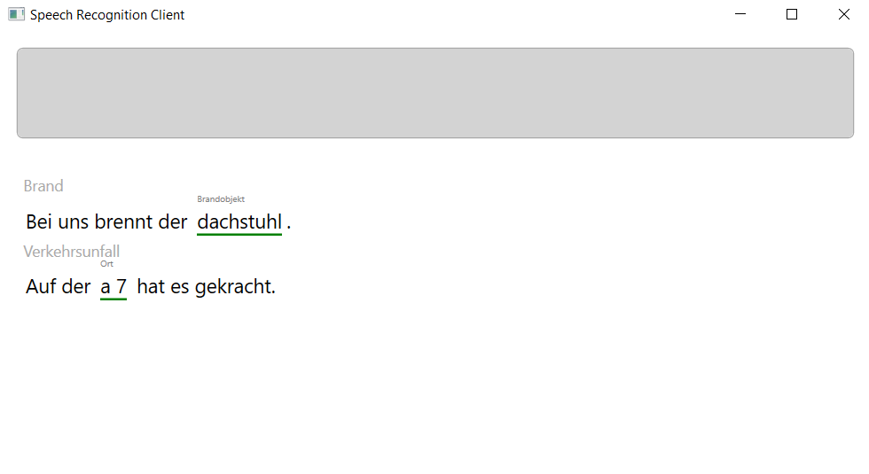

# Speech Capture application to demonstrate Azure Cognitive Services

I regularly demonstrate how to use the [Microsoft Azure Cognitive Services](https://azure.microsoft.com/en-us/services/cognitive-services/) and tried to find a way how to send a microphone input stream directly to the [Language Understanding Service (LUIS)](https://www.luis.ai).

So.. here it is. Feel free to use it, any feedback (or pull request) is welcome!



## Usage
The client is a WPF App (.NET Core), the main entry point can be found in the _MainViewModel.cs_

### MainViewModel.cs
```cs
public async Task InitializeAsync()
{
    this.speechRecognizer.SpeechStateChanged += SpeechRecognizer_SpeechStateChanged;
    this.speechRecognizer.IntentRecognized += SpeechRecognizer_IntentRecognized;

    await this.speechRecognizer.StartAsync();
}
```

Alternatively you can use an overload of the ```StartAsync``` method to provide a pre-recorded file instead of the microphone input.
```cs
await this.speechRecognizer.StartAsync("C:\temp.wav");
```

### appsettings.json
Please specify your Subscription key, your LUIS App Id and the Azure region in the _appsettings.json_ file:

```json
{
  "SpeechRecognizerSettings": {
    "SubscriptionKey": "xxx",
    "Region": "westeurope",
    "LuisAppId": "yyy"
  }
}

```